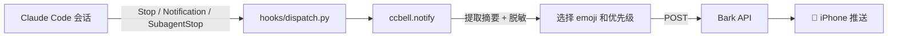

# ccbell 🔔

> 让 Claude Code 会话结束时，iPhone 第一时间响一声。Windows / macOS / Linux 全支持，多设备自动区分。


## ✨ 特性

- 🔔 **Stop / Notification / SubagentStop** 三类事件全覆盖
- 🏷️ 多设备用不同 emoji + 名字区分，Bark 通知按设备分组
- 📝 自动抽取会话最后一句 AI 回复作为摘要，路径自动脱敏
- 🚦 按 `stop_reason` 智能切换 ✅ / ❌ / 🛑 / ⚠️ / 🤖 emoji 和优先级
- 🪶 零第三方依赖，核心仅 245 行 Python

## 🧰 前置要求

1. iPhone 安装 [Bark App](https://apps.apple.com/app/id1403753865)
2. 打开 Bark → 首页复制你的 **Key**
3. 本机 Python ≥ 3.9
4. 已安装 Claude Code

## 🚀 三步上手

### Windows（PowerShell）

```powershell
# 一行安装：填入你的 Bark Key、设备名、emoji
iwr -useb https://raw.githubusercontent.com/PhilharmyWang/ccbell/main/scripts/install.ps1 `
  | powershell -args -bark_key "YOUR_BARK_KEY_HERE" -device_name "我的笔记本" -emoji "💻"
```

### macOS / Linux

```bash
# 一行安装
curl -fsSL https://raw.githubusercontent.com/PhilharmyWang/ccbell/main/scripts/install.sh \
  | bash -s -- --bark-key "YOUR_BARK_KEY_HERE" --device-name "我的笔记本" --emoji "💻"
```

### 无外网环境

```bash
# 先在有网络的机器上下载
git clone https://github.com/PhilharmyWang/ccbell.git
scp -r ccbell/ user@target:~/ccbell/

# 在目标机器上离线安装
cd ~/ccbell && bash scripts/install.sh --offline \
  --bark-key "YOUR_BARK_KEY_HERE" --device-name "远程服务器" --emoji "🖥️"
```

安装完成后，**新开一个 Claude Code 会话并说一句话** — iPhone 应收到通知。

## 🖥️ 多设备部署

| 设备 | `--device-name` | `--emoji` | 通知分组 |
|------|-----------------|-----------|---------|
| 笔记本 | 我的笔记本 | 💻 | ccbell-我的笔记本 |
| 工位电脑 | 工位台式 | 🖥️ | ccbell-工位台式 |
| 远程服务器 | GPU服务器 | 🗄️ | ccbell-GPU服务器 |
| HPC 节点 | HPC-登录节点 | 🔬 | ccbell-HPC-登录节点 |

每台设备独立安装一次即可，Bark 通知自动按 `ccbell-<设备名>` 分组。

## 🧪 工作原理



Claude Code 的 **Stop / Notification / SubagentStop** 事件通过 JSON 传给 `dispatch.py`，`notify` 模块提取摘要、脱敏路径、选择 emoji，然后 POST 到 Bark。

## ⚙️ 环境变量

| 变量 | 说明 | 默认值 |
|------|------|--------|
| `BARK_KEY` | Bark 推送 Key（必填） | — |
| `BARK_SERVER` | Bark 服务器地址 | `https://api.day.app` |
| `CCBELL_DEVICE_NAME` | 设备名称，用于通知标题 | 主机名 |
| `CCBELL_DEVICE_EMOJI` | 设备 emoji 前缀 | 💻 |
| `CCBELL_GROUP` | Bark 通知分组名 | `ccbell-<设备名>` |
| `CCBELL_MIN_DURATION_SECONDS` | 最短会话时长（秒），低于此值不推送 | `0` |
| `CCBELL_SUMMARY_MAX_LENGTH` | 摘要最大字符数 | `300` |
| `CCBELL_DEBUG` | 调试模式（`1`=开启） | 关闭 |
| `CCBELL_DRY_RUN` | 试运行模式，只打印不推送 | 关闭 |

安装脚本会自动将前三个环境变量写入 Claude Code 的 `settings.json` 的 `env` 字段，子进程自动继承。

## 🏷️ stop_reason 映射

| stop_reason | emoji | 含义 | Bark 优先级 |
|-------------|-------|------|------------|
| `end_turn` | ✅ | 正常完成 | active |
| `error` / `api_error` | ❌ | 出错退出 | timeSensitive |
| `user_interrupted` | 🛑 | 用户中断 | active |
| `max_tokens` | ⚠️ | 超长截断 | timeSensitive |
| Notification 事件 | ⚠️ | 需要确认 | timeSensitive |
| SubagentStop 事件 | 🤖 | 子任务完成 | active |

## ❓ 常见问题

**Q: Bark Key 在哪里拿？**
A: iPhone 打开 Bark App → 首页顶部一串字母就是你的 Key。

**Q: 安装后没收到通知？**
A: ① 确认 `settings.json` 中有三个 ccbell hooks 条目；② 关闭旧的 Claude Code 会话并新开一个；③ 手动测试：`cat tests/fixtures/sample_stop.json | python hooks/dispatch.py`。

**Q: 设备名用中文可以吗？**
A: 可以。中文字符会被自动 URL 编码，Bark 正常显示。

**Q: 公司内网 / 自建 Bark 服务器？**
A: 设置 `BARK_SERVER` 为你的服务器地址即可，安装时通过 `--bark-server` 参数传入。

**Q: 如何卸载？**
A: Windows 运行 `powershell scripts/uninstall.ps1`，Linux/macOS 运行 `bash scripts/uninstall.sh`。

## 🛠️ 开发

```bash
git clone https://github.com/PhilharmyWang/ccbell.git
cd ccbell
python -m pytest tests/ -v
```

欢迎提 issue 和 PR。提交前请确保 `pytest` 和 `python scripts/check_secrets.py` 均通过。

## 📄 License

[MIT](LICENSE)
