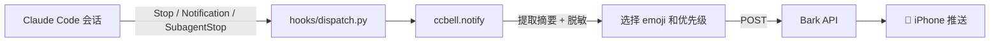

# ccbell 🔔

> 让 Claude Code 会话结束时，iPhone 第一时间响一声。Windows / macOS / Linux 全支持，多设备自动区分。


## ✨ 特性

- 🔔 **Stop / Notification / SubagentStop** 三类事件全覆盖
- 🏷️ 多设备用不同 emoji + 名字区分，Bark 通知按设备分组
- 📝 自动抽取会话最后一句 AI 回复作为摘要，路径自动脱敏
- 🚦 按 `stop_reason` 智能切换 ✅ / ❌ / 🛑 / ⚠️ / 🤖 emoji 和优先级
- 🪶 零第三方依赖，核心仅 245 行 Python

## 🧰 前置要求

1. iPhone 安装 [Bark App](https://apps.apple.com/app/id1403753865)
2. 打开 Bark → 首页复制你的 **Key**
3. 本机 Python ≥ 3.9
4. 已安装 Claude Code

## 💻 支持的系统

| 系统 | 测试版本 | 一键脚本 |
|---|---|---|
| Windows 10 / 11 | Python 3.9 - 3.13 | `scripts/install.ps1` |
| macOS 12+ | Python 3.9 - 3.13 | `scripts/install.sh` |
| Linux | Ubuntu / Debian / CentOS / RHEL / Fedora / openSUSE / Arch 等任意发行版 | `scripts/install.sh` |

> 超算 / 服务器：只要登录节点能访问 `api.day.app`（默认 Bark 服务器）或你自建的 Bark server，就能部署；无外网环境请使用 `--offline` 模式。

## 🚀 三步上手

### Windows（PowerShell）

```powershell
# 一行安装：填入你的 Bark Key、设备名、emoji
iwr -useb https://raw.githubusercontent.com/PhilharmyWang/ccbell/main/scripts/install.ps1 `
  | powershell -args -bark_key "YOUR_BARK_KEY_HERE" -device_name "我的笔记本" -emoji "💻"
```

### macOS / Linux

```bash
# 一行安装
curl -fsSL https://raw.githubusercontent.com/PhilharmyWang/ccbell/main/scripts/install.sh \
  | bash -s -- --bark-key "YOUR_BARK_KEY_HERE" --device-name "我的笔记本" --emoji "💻"
```

### 无外网环境

```bash
# 先在有网络的机器上下载
git clone https://github.com/PhilharmyWang/ccbell.git
scp -r ccbell/ user@target:~/ccbell/

# 在目标机器上离线安装
cd ~/ccbell && bash scripts/install.sh --offline \
  --bark-key "YOUR_BARK_KEY_HERE" --device-name "远程服务器" --emoji "🖥️"
```

安装完成后，**新开一个 Claude Code 会话并说一句话** — iPhone 应收到通知。

### 更多使用示例

#### 示例 1：最小配置（只填必填三项）

Windows：

```powershell
powershell -ExecutionPolicy Bypass -File scripts\install.ps1 `
  -BarkKey "YOUR_BARK_KEY_HERE" `
  -DeviceName "MyMachine" `
  -DeviceEmoji "💻"
```

#### 示例 2：用自建 Bark Server

```bash
bash scripts/install.sh \
  --bark-key "YOUR_BARK_KEY_HERE" \
  --device-name "HomeServer" \
  --device-emoji "🏠" \
  --bark-server "https://bark.example.com"
```

#### 示例 3：自定义安装目录

```powershell
powershell -ExecutionPolicy Bypass -File scripts\install.ps1 `
  -BarkKey "YOUR_BARK_KEY_HERE" `
  -DeviceName "WorkStation" `
  -DeviceEmoji "🖥️" `
  -InstallDir "D:\tools\ccbell"
```

#### 示例 4：同时设置 Claude Code 的 API Token（z.ai / Moonshot 等第三方）

```powershell
powershell -ExecutionPolicy Bypass -File scripts\install.ps1 `
  -BarkKey "YOUR_BARK_KEY_HERE" `
  -DeviceName "MyMachine" `
  -DeviceEmoji "💻" `
  -ZaiToken "YOUR_ANTHROPIC_TOKEN_HERE"
```

#### 示例 5：只记录不推送（调试用）

装完后临时在 `~/.claude/settings.json` 的 `env` 块加一行 `"CCBELL_DRY_RUN": "1"`，日志会记录但不真推，用于确认 hook 触发正常。

#### 示例 6：过滤短会话（少于 30 秒不推送）

`env` 块加 `"CCBELL_MIN_DURATION_SECONDS": "30"`，避免被短问答刷屏。

## 🖥️ 多设备部署

每台设备用不同的 `--device-name` 和 `--device-emoji`，通知标题自动带设备标识，Bark 里按设备分组聚合，一眼看清是哪台机器在响。

### 推荐场景与 emoji 搭配

| 使用场景 | 建议 name | 建议 emoji |
|---|---|---|
| 个人笔记本 | Laptop / MyMac | 💻 🧑‍💻 |
| 办公台式机 | Desktop / OfficePC | 🖥️ 🏢 |
| 家用服务器 / NAS | HomeServer / NAS | 🏠 📦 |
| 云服务器（AWS / 阿里云等） | CloudVM / Prod-EC2 | ☁️ 🌩️ |
| 远程开发服务器 | DevBox / RemoteDev | 🛠️ 🔧 |
| 数据科学 / 训练主机 | TrainBox / GPU-Node | 🧪 🔬 🧬 |
| HPC / 超算节点 | HPC-Node / Cluster | 🖧 ⚡ |
| 树莓派 / 边缘设备 | EdgePi / IoT | 🍓 📡 |
| Docker / K8s 容器内 | Container / Pod-01 | 🐳 ☸️ |
| 同事 / 团队共享机 | TeamMachine | 👥 🤝 |

emoji 随意选，你觉得能一眼认出这台设备即可 —— Bark 通知里它会出现在标题开头。

### 两种典型用法

**个人多终端**：笔记本 💻 + 台式机 🖥️ + NAS 🏠，会议时笔记本安静了，NAS 还在跑长任务，通知一响你立刻知道是哪台。

**团队共享训练机**：TrainBox-A 🧬 + TrainBox-B 🔬，不同成员跑的任务同时推同一个 Bark key，靠 name 区分是哪台机器在响、group 聚合能按机器折叠。

## 🧪 工作原理



Claude Code 的 **Stop / Notification / SubagentStop** 事件通过 JSON 传给 `dispatch.py`，`notify` 模块提取摘要、脱敏路径、选择 emoji，然后 POST 到 Bark。

## ⚙️ 环境变量

| 变量 | 说明 | 默认值 |
|------|------|--------|
| `BARK_KEY` | Bark 推送 Key（必填） | — |
| `BARK_SERVER` | Bark 服务器地址 | `https://api.day.app` |
| `CCBELL_DEVICE_NAME` | 设备名称，用于通知标题 | 主机名 |
| `CCBELL_DEVICE_EMOJI` | 设备 emoji 前缀 | 💻 |
| `CCBELL_GROUP` | Bark 通知分组名 | `ccbell-<设备名>` |
| `CCBELL_MIN_DURATION_SECONDS` | 最短会话时长（秒），低于此值不推送 | `0` |
| `CCBELL_SUMMARY_MAX_LENGTH` | 摘要最大字符数 | `300` |
| `CCBELL_DEBUG` | 调试模式（`1`=开启） | 关闭 |
| `CCBELL_DRY_RUN` | 试运行模式，只打印不推送 | 关闭 |

安装脚本会自动将前三个环境变量写入 Claude Code 的 `settings.json` 的 `env` 字段，子进程自动继承。

> **组合使用示例**：
> - 想要默认所有通知都启用 debug + 只记不推：`CCBELL_DEBUG=1` + `CCBELL_DRY_RUN=1`
> - 想要个人使用时按任务分组：每个项目单独起一个 `CCBELL_GROUP=proj-xxx`
> - 想要同一台机器上区分多个身份（比如个人 vs 工作）：让两个身份用不同的 `~/.claude/settings.json` 并设不同 `CCBELL_DEVICE_NAME`

## 🏷️ stop_reason 映射

| stop_reason | emoji | 含义 | Bark 优先级 |
|-------------|-------|------|------------|
| `end_turn` | ✅ | 正常完成 | active |
| `error` / `api_error` | ❌ | 出错退出 | timeSensitive |
| `user_interrupted` | 🛑 | 用户中断 | active |
| `max_tokens` | ⚠️ | 超长截断 | timeSensitive |
| Notification 事件 | ⚠️ | 需要确认 | timeSensitive |
| SubagentStop 事件 | 🤖 | 子任务完成 | active |

## ❓ 常见问题

**Q: Bark Key 在哪里拿？**
A: iPhone 打开 Bark App → 首页顶部一串字母就是你的 Key。

**Q: 安装后没收到通知？**
A: ① 确认 `settings.json` 中有三个 ccbell hooks 条目；② 关闭旧的 Claude Code 会话并新开一个；③ 手动测试：`cat tests/fixtures/sample_stop.json | python hooks/dispatch.py`。

**Q: 设备名用中文可以吗？**
A: 可以。中文字符会被自动 URL 编码，Bark 正常显示。

**Q: 公司内网 / 自建 Bark 服务器？**
A: 设置 `BARK_SERVER` 为你的服务器地址即可，安装时通过 `--bark-server` 参数传入。

**Q: Ubuntu / CentOS / Debian 超算节点怎么装？**
A: 和任何 Linux 一样，用 `scripts/install.sh` 即可。如果登录节点无外网，用 `--offline` 模式：在有外网的机器上 git clone 后 scp 整个目录到超算，然后在超算上跑：
```bash
bash ccbell/scripts/install.sh --offline \
  --bark-key "YOUR_BARK_KEY_HERE" \
  --device-name "HPC-Login" --device-emoji "⚡"
```

**Q: 可以同时部署到很多台机器吗？每台都要单独装吗？**
A: 是的，每台机器都需要各自装一次（Claude Code 的 hook 是每台机器独立配置的）。不同设备用不同的 `--device-name` / `--device-emoji`，推送时会自动区分。如果有 10+ 台机器，可以用 Ansible / 批量 ssh + `scripts/install.sh` 批量部署。

**Q: 如何卸载？**
A: Windows 运行 `powershell scripts/uninstall.ps1`，Linux/macOS 运行 `bash scripts/uninstall.sh`。

## 🛠️ 开发

```bash
git clone https://github.com/PhilharmyWang/ccbell.git
cd ccbell
python -m pytest tests/ -v
```

欢迎提 issue 和 PR。提交前请确保 `pytest` 和 `python scripts/check_secrets.py` 均通过。

## 📄 License

[MIT](LICENSE)
