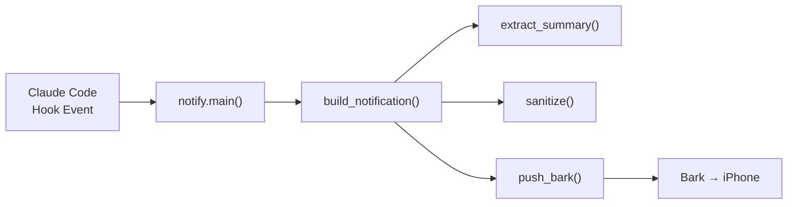

# ccbell 设计文档

> v0.2.0 — 重构日期：2026-04-17

---

## 目标

在每个 Claude Code 会话结束或等待输入时，自动把设备名 + 摘要推送到 iPhone（Bark）。

## 非目标

- 多后端插件化（只做 Bark）
- YAML 配置（只用环境变量）
- Webhook / IM 推送
- pip 发布

---

## 架构

```
ccbell/notify.py          # 核心（~180 行）：配置、日志、摘要、脱敏、推送
ccbell/enrich.py          # 可选上下文（~60 行）：git branch / GPU / Slurm
hooks/dispatch.py         # 入口（<15 行）：sys.path + import notify.main
```



---

## 事件 → emoji / level 映射

| Hook Event | Emoji | Label | Bark Level |
|------------|-------|-------|------------|
| `Stop` | ✅ | 完成 | `active` |
| `Notification` | ⚠️ | 需要确认 | `timeSensitive` |
| `SubagentStop` | 🤖 | 子任务完成 | `active` |
| 其他 | 🔔 | 事件 | `active` |

---

## 路径脱敏规则

| 原始模式 | 替换为 |
|----------|--------|
| `/home/<user>/...` | `~/...` |
| `/Users/<user>/...` | `~/...` |
| `C:\Users\<user>\...` | `~/...` |
| `/root/...` | `~/...` |
| URL 中的 IPv4 字面量 | `<redacted-host>` |

---

## 环境变量

| 变量 | 默认值 | 说明 |
|------|--------|------|
| `BARK_KEY` | *(必填)* | Bark 设备密钥 |
| `BARK_SERVER` | `https://api.day.app` | Bark 服务器 |
| `CCBELL_DEVICE_NAME` | hostname | 设备名 |
| `CCBELL_DEVICE_EMOJI` | `💻` | 设备 emoji |
| `CCBELL_GROUP` | `ccbell-{name}` | 通知分组 |
| `CCBELL_DEBUG` | `0` | 调试模式 |
| `CCBELL_DRY_RUN` | `0` | 干跑（不推送） |
| `CCBELL_MIN_DURATION_SECONDS` | `0` | 最短会话时长过滤 |
| `CCBELL_SUMMARY_MAX_LENGTH` | `200` | 摘要最大长度 |
