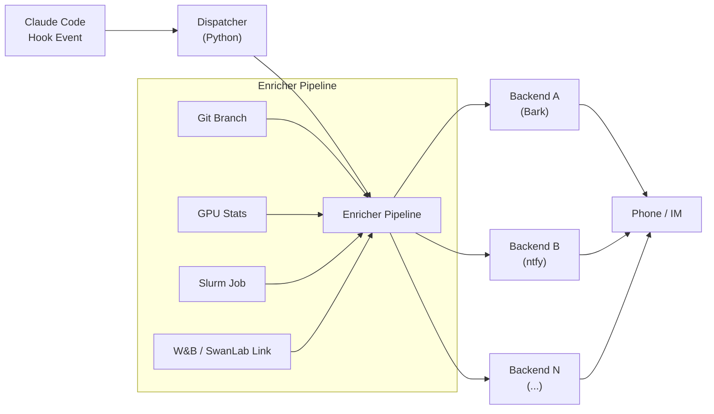

# ccbell 设计文档

> 版本：v0.1（设计阶段）
> 最后更新：2026-04-17

---

## 1. 背景与动机

在 ML / scientific research workflows 中，开发者经常需要在远程 SSH 会话或 HPC 集群上长时间运行 Claude Code 任务（代码生成、数据分析、实验调试等）。当会话结束或等待用户输入时，用户往往不在终端前，导致：

- 无法及时知道任务已完成，浪费等待时间
- 多台设备同时运行时，难以区分通知来源
- 缺少训练实验、GPU 状态等上下文，收到通知后还需手动查看

ccbell 的目标：**在每个 Claude Code 会话结束或等待输入时，自动把设备名 + 项目名 + 会话摘要 + 可选上下文推送到手机或 IM。**

---

## 2. 核心架构



**流程：**

1. Claude Code 触发 Hook 事件（`Stop` / `Notification` / `SubagentStop`）
2. Dispatcher 读取 `transcript.jsonl`，生成会话摘要
3. Enricher Pipeline 依次执行所有启用的 enricher，聚合附加信息
4. Dispatcher 组装最终消息（标题 + 正文），通过环境变量传递给各 Backend
5. 各 Backend 独立推送，失败不影响其他 Backend

---

## 3. 目录结构职责说明

```
ccbell/                     # Python 包根目录
├── __init__.py
├── __main__.py             # python -m ccbell 入口
├── config.py               # 配置加载（YAML + 环境变量）
├── dispatcher.py           # 核心调度逻辑
├── logger.py               # 日志
├── summary.py              # 摘要提取与脱敏
├── backends/               # 通知后端子包
│   ├── __init__.py
│   ├── base.py             # 共用工具（read_invocation_env, die）
│   └── bark.py             # Bark 后端
├── docs/                   # 设计文档
│   └── DESIGN.md
├── hooks/                  # Claude Code hook 入口
│   └── dispatch.py
├── enrichers/              # 上下文增强器（Step 4）
├── tests/
│   ├── fixtures/           # 测试固件
│   └── test_*.py
├── config.example.yaml     # 示例配置（入库）
├── config.yaml             # 真实配置（不入库）
├── pyproject.toml
├── .github/workflows/
├── .gitignore
├── LICENSE
└── README.md
```

---

## 4. Hook 生命周期

ccbell 通过 Claude Code 的 Hook 机制触发。Hook 在 `settings.json` 中注册，Claude Code 在特定事件发生时调用对应脚本。

### 4.1 支持的 Hook 事件

| Hook Event        | 触发时机                                      | 用途                     |
|--------------------|-----------------------------------------------|--------------------------|
| `Stop`             | Claude Code 会话正常结束                      | 推送会话完成通知          |
| `Notification`     | Claude Code 等待用户输入超过一定时间           | 推送「等待输入」提醒      |
| `SubagentStop`     | 子代理（subagent）会话结束                    | 可选：推送子任务完成通知   |

### 4.2 主要 Payload 字段

Hook 脚本通过环境变量或 stdin 接收以下信息：

| 字段                | 说明                                     |
|---------------------|------------------------------------------|
| `session_id`        | Claude Code 会话唯一标识                  |
| `cwd`               | 当前工作目录（用于推断项目名）             |
| `transcript_path`   | `transcript.jsonl` 文件路径               |
| `hook_event_name`   | 触发的 hook 事件名（`Stop` / `Notification` / `SubagentStop`） |

> 具体的 payload 格式待 Step 1 实现 hook 脚本时确认，此处为设计草案。

### 4.3 Step 1 实现说明

- **入口脚本**：`hooks/dispatch.py`（`python3 hooks/dispatch.py` 或 `python -m ccbell`）
- **Python 包**：`ccbell/` 包，包含 `dispatcher.py`（核心调度）、`config.py`（环境变量配置）、`logger.py`（日志）
- **日志文件**：`~/.ccbell/ccbell.log`
- **本步未实现**：backends 调用、summary 解析、config.yaml、enrichers、duration 过滤

---

## 5. 配置系统

配置文件为 `config.yaml`，位于项目根目录（已加入 `.gitignore`）。

### 5.1 配置草案

```yaml
# === 设备标识 ===
device:
  name: laptop              # 显示在通知标题中，如 "laptop / ccbell"
  group: local              # 分组：local / cluster / cloud

# === 通知后端 ===
backends:
  - name: bark
    enabled: true
    # backend-specific params
    url: "https://your-bark-server.example.com"
    key: "your-bark-key"
  - name: ntfy
    enabled: true
    url: "https://ntfy.sh"
    topic: "your-ntfy-topic"
  - name: feishu
    enabled: false
    webhook_url: "https://open.feishu.cn/open-apis/bot/v2/hook/YOUR_TOKEN"
  # ... 更多后端

# === 上下文增强器 ===
enrichers:
  - name: git_branch
    enabled: true
  - name: gpu_stats
    enabled: false
  - name: slurm_job
    enabled: false
    account: "YOUR_ACCOUNT"
    partition: "YOUR_PARTITION"
  - name: wandb
    enabled: false
    project: "YOUR_PROJECT"
  - name: swanlab
    enabled: false
    project: "YOUR_PROJECT"

# === 长任务过滤 ===
filters:
  min_duration_seconds: 300   # 低于 5 分钟的会话不推送

# === 摘要设置 ===
summary:
  max_length: 200             # 摘要最大字符数
  truncate_suffix: "..."
```

---

## 6. 多后端可插拔约定

### 6.1 Backend 接口约定

每个 Backend 模块（`ccbell/backends/<name>.py`）遵循以下约定：

**Dispatcher 调用方式：**

Dispatcher 通过 `subprocess.run([sys.executable, "-m", "ccbell.backends.<name>"])` 调用后端，并传入以下环境变量：

| 环境变量               | 说明                                           |
|------------------------|------------------------------------------------|
| `CCBELL_TITLE`         | 通知标题                                       |
| `CCBELL_BODY`          | 通知正文（含 enricher 附加内容）                |
| `CCBELL_GROUP`         | 设备分组标识                                    |
| `CCBELL_LEVEL`         | 通知级别（`info` / `warning` / `error`）        |
| `CCBELL_BACKEND_CONFIG`| JSON 字符串，包含该 backend 在 config.yaml 中的所有专属参数（key, server, sound, level_map 等） |

**Backend 读取配置方式：**

- 调用 `read_invocation_env()` 从环境变量获取通用字段和 `backend_config` 字典
- 从 `backend_config` 中读取自己需要的参数（如 `key`, `server`, `sound`, `level_map`）

**输出约定：**

- 退出码 `0`：推送成功
- 退出码非 `0`：推送失败，错误信息输出到 `stderr`
- Dispatcher 不关心 Backend 的具体实现，只关心退出码

**配置读取：**

- Backend 的专属配置从 `config.yaml` 的 `backends` 列表中对应 `name` 的条目读取
- Dispatcher 在调用时将该条目（去掉 `name` 和 `enabled` 字段）序列化为 JSON 放入 `CCBELL_BACKEND_CONFIG`

### 6.2 新增 Backend 步骤

1. 在 `backends/` 下创建 `<name>.py`
2. 在 `config.yaml` 的 `backends` 列表中添加对应配置块
3. 将 `enabled` 设为 `true`

---

## 7. Enricher 可插拔约定

### 7.1 Enricher 接口约定

每个 Enricher 脚本（`enrichers/<name>.py`）遵循以下约定：

**输入：**

- 工作目录为当前项目的 `cwd`
- 可访问 `config.yaml` 中自己的配置块

**输出约定：**

- 标准输出（`stdout`）输出**一行文本**，即附加到通知正文的信息
- 任何错误静默忽略，不影响主流程
- Enricher 超时或崩溃时，Dispatcher 跳过该 enricher

**聚合方式：**

```
[会话摘要]
---
[GPU: 2x A100, 85% utilized]
[Slurm: job 12345, RUNNING, partition: gpu]
[Git: feature/expr-42]
[W&B: https://wandb.ai/YOUR_PROJECT/runs/abc123]
```

### 7.2 新增 Enricher 步骤

1. 在 `enrichers/` 下创建 `<name>.py`
2. 在 `config.yaml` 的 `enrichers` 列表中添加对应配置块
3. 将 `enabled` 设为 `true`

---

## 8. 长任务阈值过滤策略

**目的：** 避免短会话（如快速问答）频繁推送通知。

**策略：**

1. Dispatcher 读取 `transcript.jsonl` 的首条消息时间戳 `t_start`
2. Hook 触发时间为 `t_now`
3. 会话持续时间 `duration = t_now - t_start`
4. 若 `duration < config.filters.min_duration_seconds`，则**静默跳过**，不推送
5. 阈值默认 300 秒（5 分钟），用户可在 `config.yaml` 中自定义

**特殊情况：**

- `Notification` 事件不受阈值过滤（等待输入的通知总是推送）
- 若无法获取 `t_start`（transcript 为空或损坏），默认推送

---

## 9. 安全与隐私

### 9.1 摘要截断

- 摘要最大长度由 `config.yaml` 的 `summary.max_length` 控制（默认 200 字符）
- 超出部分截断，追加 `summary.truncate_suffix`（默认 `...`）

### 9.2 敏感路径脱敏

以下路径在摘要中出现时自动替换为占位符：

| 原始模式                         | 替换为              |
|----------------------------------|---------------------|
| `/home/<username>/...`           | `~/...`             |
| `/Users/<username>/...`          | `~/...`             |
| `C:\Users\<username>\...`        | `~/...`             |
| 包含真实 IP 的 URL               | `<redacted-host>`   |

### 9.3 配置安全

- `config.yaml` 已加入 `.gitignore`，不会进入版本控制
- Backend 的密钥、token 等敏感信息仅存于 `config.yaml`
- 文档示例一律使用占位符

### 9.4 Hook 失败静默

- Hook 脚本执行失败时，只记录日志（`ccbell.log`），不影响 Claude Code 正常运行
- Dispatcher 捕获所有异常，确保不会因通知模块崩溃而中断会话

---

## 10. Roadmap

| Step | 内容                                  | 说明                                               |
|------|---------------------------------------|----------------------------------------------------|
| 1    | Hook 注册与 Dispatcher 骨架           | 在 `settings.json` 中注册 hook，实现 Dispatcher 主循环 |
| 2    | Transcript 解析与摘要生成             | 读取 `transcript.jsonl`，提取最后一条 assistant 回复   |
| 3    | 后端实现：Bark + ntfy                 | 实现两个默认后端，验证端到端流程                       |
| 4    | Enricher 实现：Git + GPU + Slurm      | 实现三个核心 enricher                                |
| 5    | 长任务阈值过滤                        | 实现 duration 过滤逻辑                               |
| 6    | 多后端扩展：Feishu / WeCom / Telegram / Email | 实现更多后端                               |
| 7    | 测试与 CI                             | 单元测试、集成测试、GitHub Actions                    |
| 8    | 文档完善与 v1.0 发布                  | 补全 README、使用指南、发布到 PyPI                    |
